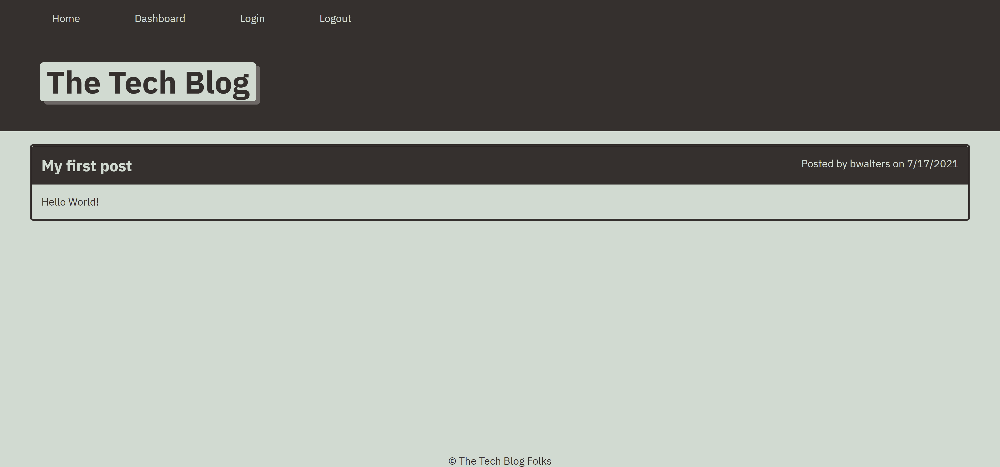

# tech-blog

## Description

My motivation for creating this project was to get more practice using MVC file structure, create an app from from to back having login/signup functionality. This application is useful for anyone looking to start a blog or online journal. During this project, I learened how to keep a clean file structure and how to section out my code into smaller chunks.

## Table of Contents

- [Installation](#installation)
- [Usage](#usage)
- [License](#license)
- [Questions](#questions)

## Installation

Here is the link to the Github repository where the repo can be cloned (https://github.com/bwalters8910/tech-blog). Here is the link to the deployed application (https://tech-blog-bmw.herokuapp.com/)

## Usage

To use this app, simply visit the deployed site, create an account, and start posting.

## License

[MIT](https://choosealicense.com/licenses/mit/)

## Questions

Here is a link to my GitHub profile https://github.com/bwalters8910.
